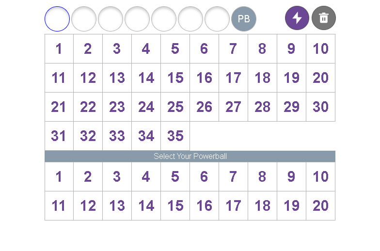
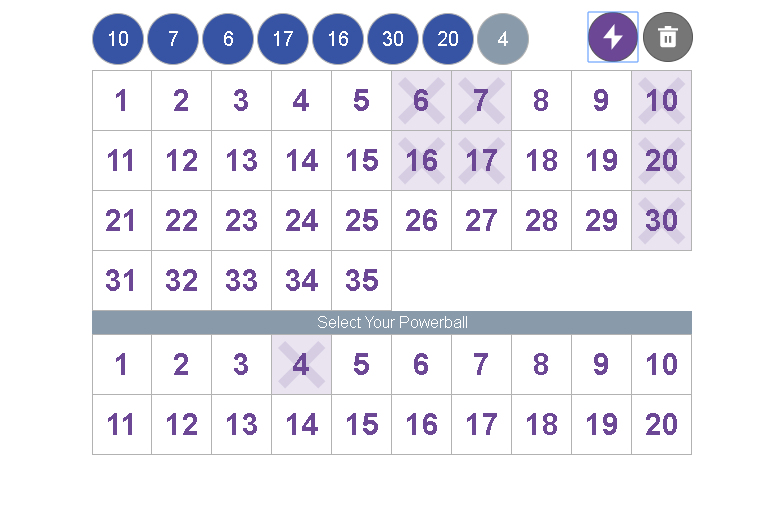

# Tabcorp Demo

A simple project that contains a Lotto Game component. The component allows selection of lotto numbers and a powerball. The component contains an autofill button that will fetch the most recent draw results from the `data.api.thelott.com` API and will populate the games selection with the results.

React is used as the front end web component framework.

- React component code is located in `src/components`
- React component tests `src/components/**/*.test.tsx` with test mocks at `src/__mocks__`
- Integration tests using selenium with the chromewebriver are located at `src/e2e/*-test.ts`

## Requirements
nodejs - `v10.15.3`
npm - `v6.9.0`

## Running

### Install dependencies
`npm install`

### Run Tests
`npm test` 

### Start Development Server
`npm test`

### Run Integration Tests
*Requires Chrome, and the server running locally on port 3000*

`npm test:e2e`

Screenshots before and after the test will be placed in the folder `e2e-demo-results`

## Results of last integration test run
### Before

### After 

# More Details on Scripts

This project was bootstrapped with [Create React App](https://github.com/facebook/create-react-app).

## Available Scripts

In the project directory, you can run:

### `npm start`

Runs the app in the development mode. 
Open [http://localhost:3000](http://localhost:3000) to view it in the browser.

The page will reload if you make edits. 
You will also see any lint errors in the console.

### `npm test`

Launches the test runner in the interactive watch mode. 
See the section about [running tests](https://facebook.github.io/create-react-app/docs/running-tests) for more information.

### `npm test:e2e`
Runs the integration tests against the a server running on localhost on port 3000. 

Will use the [chromedriver](http://chromedriver.chromium.org/) managed through [selenium](https://www.seleniumhq.org/) to launch a chrome instance and run tests in the browser against a running instance.

### `npm run build`

Builds the app for production to the `build` folder. 
It correctly bundles React in production mode and optimizes the build for the best performance.

The build is minified and the filenames include the hashes. 
Your app is ready to be deployed!

See the section about [deployment](https://facebook.github.io/create-react-app/docs/deployment) for more information.

### `npm run eject`

**Note: this is a one-way operation. Once you `eject`, you can’t go back!**

If you aren’t satisfied with the build tool and configuration choices, you can `eject` at any time. This command will remove the single build dependency from your project.

Instead, it will copy all the configuration files and the transitive dependencies (Webpack, Babel, ESLint, etc) right into your project so you have full control over them. All of the commands except `eject` will still work, but they will point to the copied scripts so you can tweak them. At this point you’re on your own.

You don’t have to ever use `eject`. The curated feature set is suitable for small and middle deployments, and you shouldn’t feel obligated to use this feature. However we understand that this tool wouldn’t be useful if you couldn’t customize it when you are ready for it.
